# 目录

[一、构建Visual Studio开发环境](#一、构建Visual-Studio开发环境)

[1. 创建项目](#1.创建项目)

[2. 引入rc_genicam_api资源文件](#2.引入rc_genicam_api资源文件)

[3. 引入libpng资源文件](#3.引入libpng资源文件)

[4. 工程属性配置](#4.工程属性配置)

[5. 远程调试配置](#5.远程调试配置)

[6. 其他配置](#6.其他配置)

[二、构建远程主机开发环境](#二、构建远程主机开发环境)

[1. 必要软件安装](#1.必要软件安装)

[2. 动态链接库配置](#2.动态链接库配置)

[3. 环境变量设置](#3.环境变量设置)

[三、rc_genicam_api工具使用](#三、rc_genicam_api工具使用)

# 一、构建Visual Studio开发环境

## 1. 创建项目

新建项目，选择C++的Linux空项目，点击下一步，填写项目名称，选择工程位置目录，点击创建。

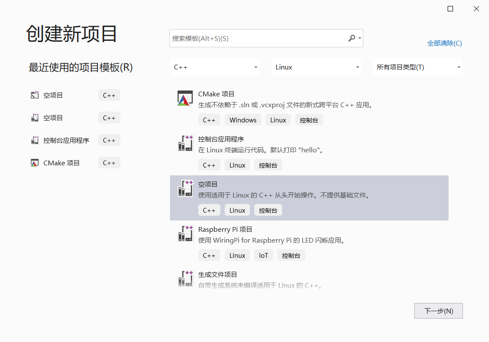

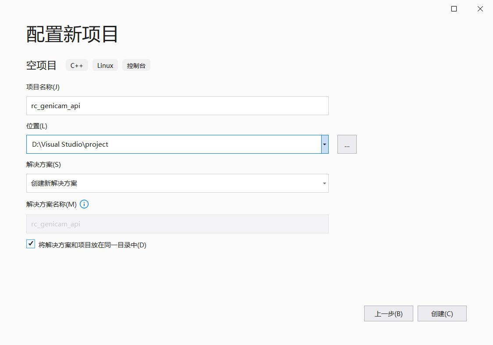

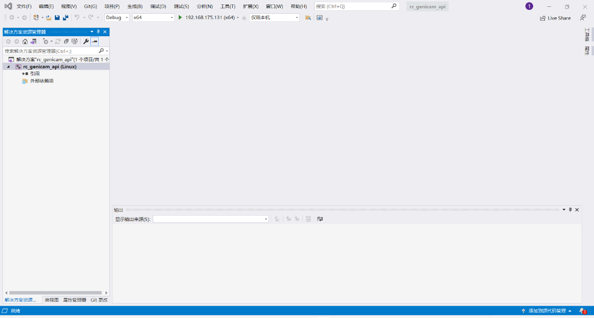

## 2. 引入rc_genicam_api资源文件

将rc_genicam_api源码包rc_genicam_api-2.5.12放在工程目录下。

rc库github地址：<https://githucom/roboception/rc_genicam_api>

rc库源码包下载地址：<https://github.com/roboception/rc_genicam_api/releases>

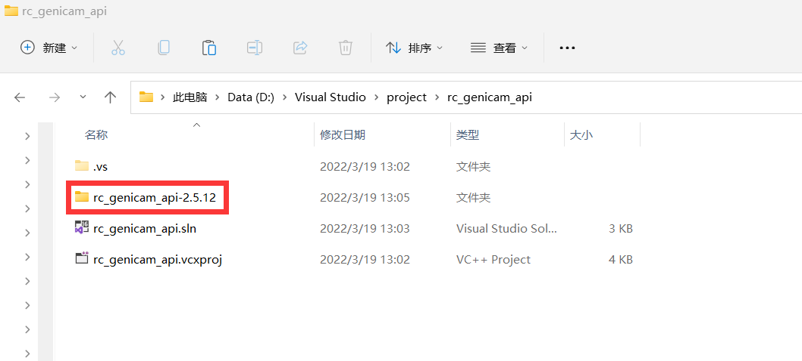

baumer目录存放的是各种架构下的.cti文件（用于相机连接）；genicam/bin目录存放的是各种架构下所需的动态链接库文件；genicam/library/CPP/include目录存放的是genicam相关头文件，是工程所需包含目录；rc_genicam_api目录是工程所使用的api的源代码；tools目录是rc库所提供的几种工具的源代码。

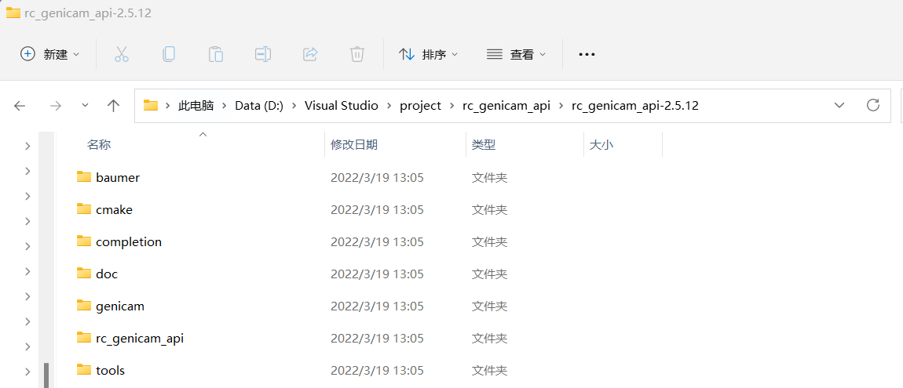

右键工程，添加→新建筛选器，填写筛选器名称，例如资源文件。

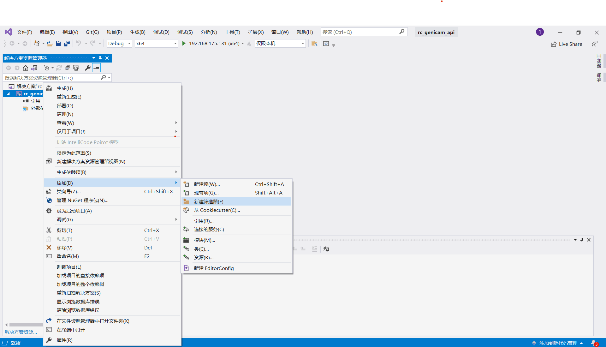

右键资源文件，添加→现有项，进入./rc_genicam_api-2.5.12/rc_genicam_api目录，选择所有.cc和.h文件（注意Linux工程不需要gentl_wrapper_win32.cc文件，同理Windows工程不需要gentl_wrapper_linux.cc文件），点击添加。

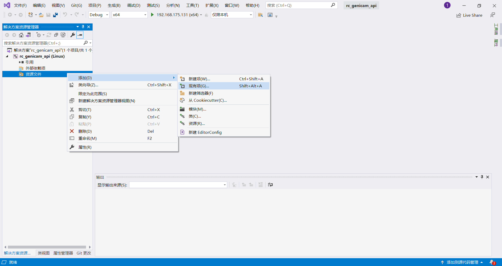

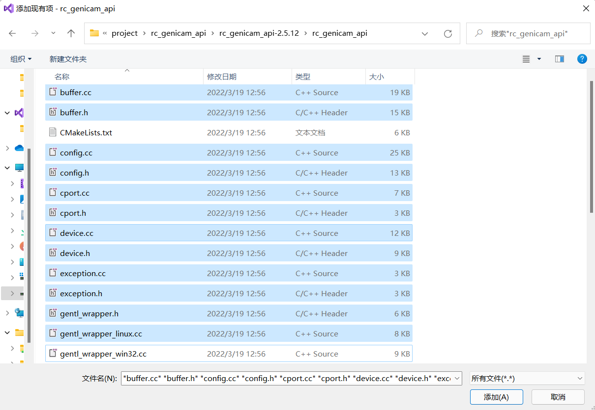

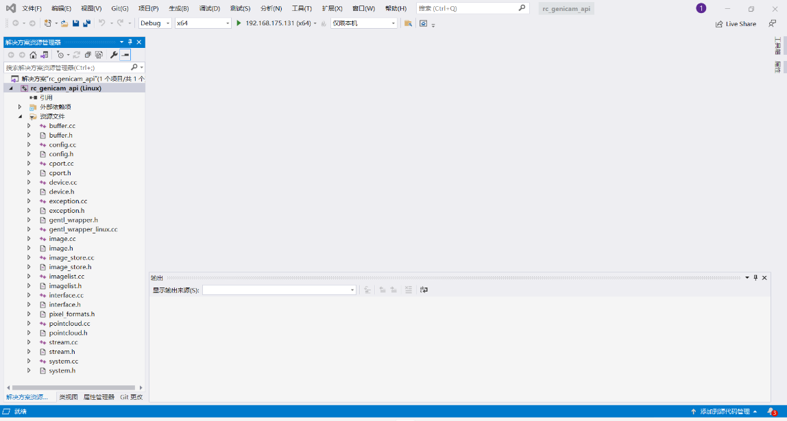

## 3. 引入libpng及libjpeg资源文件

libpng和libjpeg库用于png格式图片的处理。

libpng源码下载：<http://www.libpng.org/pub/png/libpng.html>

下载libpng源码并解压后，放在工程目录下。

libjpeg库直接拷贝[libjpeg目录](../libjpeg)到工程目录下。

## 4. 工程属性配置

右键工程，属性→配置属性→VC++目录→包含目录，加入下图所示目录，该配置可以引入工程所需头文件。

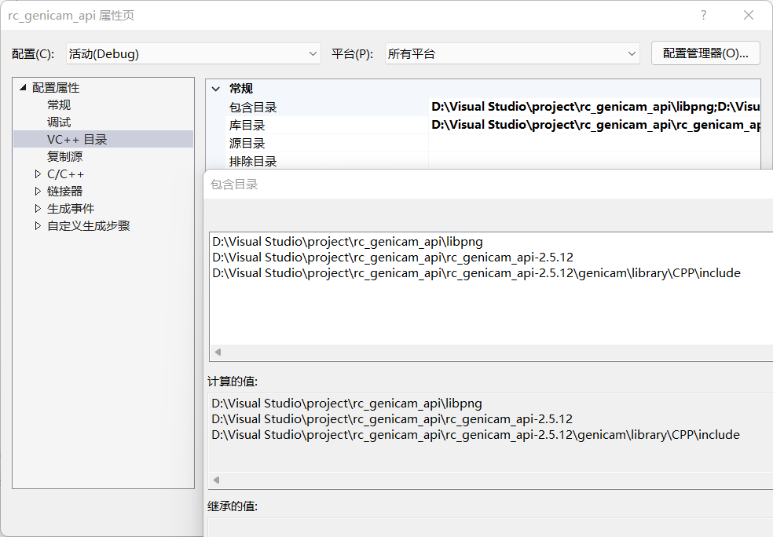

右键工程，属性→配置属性→VC++目录→库目录，加入下图所示目录，这里选择自己工程所对应架构的动态链接库目录。

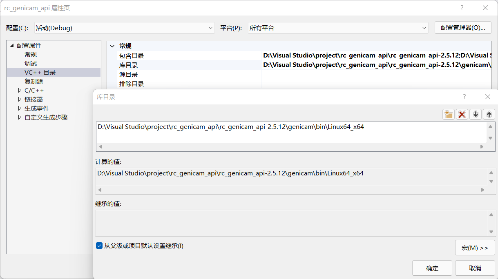

右键工程，属性→连接器→输入→库依赖项，加入以下几项：
GCBase_gcc48_v3_3

GenApi_gcc48_v3_3

XmlParser_gcc48_v3_3

NodeMapData_gcc48_v3_3

MathParser_gcc48_v3_3

log4cpp_gcc48_v3_3

Log_gcc48_v3_3

dl

png

jpeg

这里的名称使用上一步动态链接库目录下对应文件的名称，例Linux64-x64架构下使用GCBase_gcc48_v3_3，而Linux64-ARM使用GCBase_gcc49_v3_3。

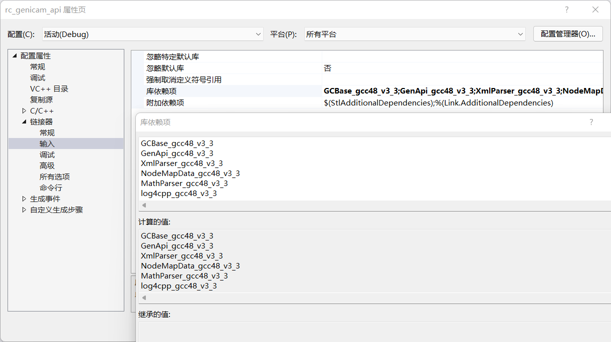

## 5. 远程调试配置

调试→选项→跨平台→添加，填写远程调试主机的ssh连接信息，测试连接状态后，成功添加该远程调试主机，选择该主机，进行远程调试。

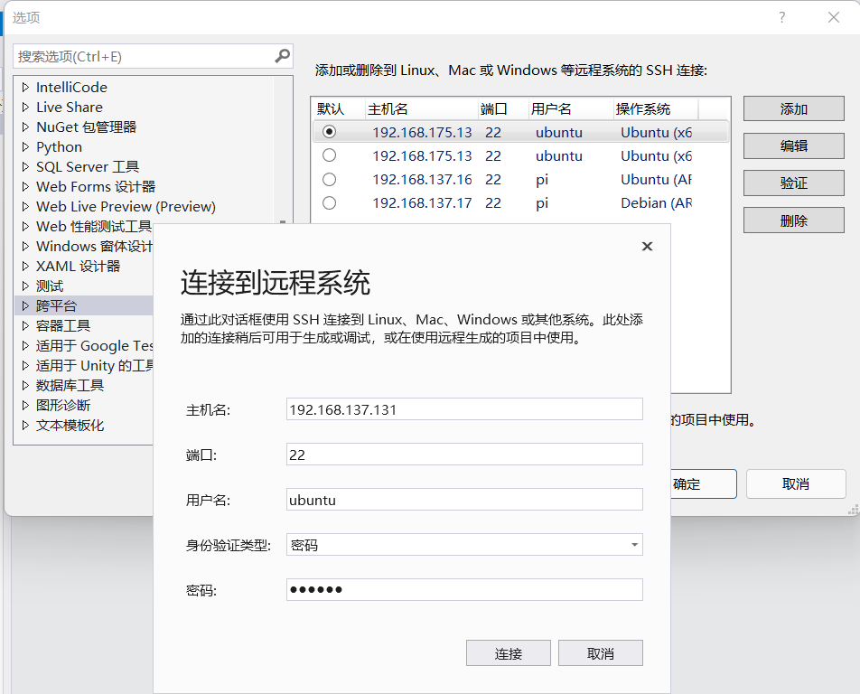

## 6. 其他配置

Linux工程需要将system.cc文件的176行的\#else删除。

控制项目生成可执行文件.out还是动态链接库文件.so，右键工程，属性→配置属性→常规→项目默认值→配置类型，选择自己所需生成对象类型。

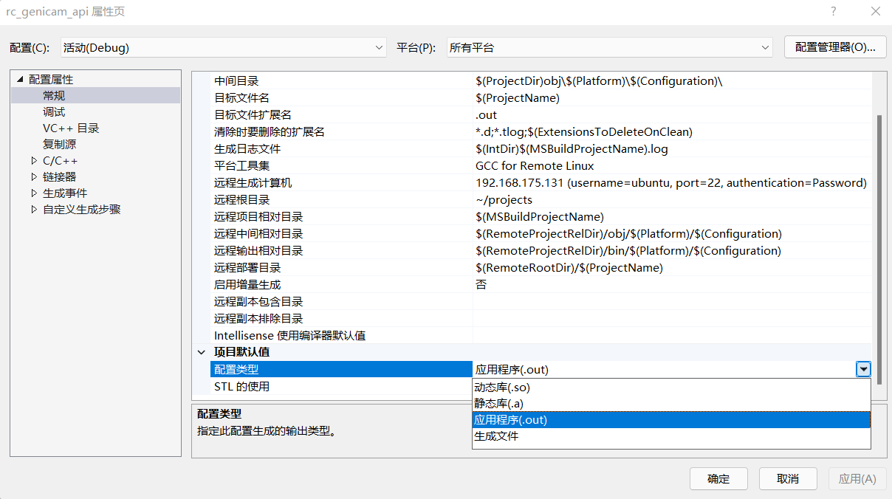

# 二、构建远程主机开发环境

远程调试主机需要一定配置以满足基于rc_genicam_api开发需求以及SDK的运行需求，以ubuntu系统为例进行如下配置。

## 1. 必要软件安装

```shell
sudo apt install -y g++ libpng-dev libjpeg9-dev
```

## 2. 动态链接库配置

Visual
Studio远程调试默认会拷贝工程资源到\~/project目录下，首先检查项目资源是否完整，通常只会拷贝源代码资源到远程调试主机，建议把rc_genicam_api-2.5.12目录拷贝到远程主机的工程目录下。

配置gcc链接环境，使得程序链接时能找到动态链接库.so文件。编辑文件/etc/ld.so.conf，添加.so文件路径，执行sudo ldconfig使配置生效。


## 3. 环境变量设置

相机连接所需.cti文件路径，需要设置对应的环境变量。编辑文件~/.bashrc，添加环境变量，执行source ~/.bashrc使配置生效。

32位系统：export GENICAM_GENTL32_PATH=cti_path

64位系统：export GENICAM_GENTL64_PATH=cti_path

.cti文件在rc_genicam_api-2.5.12/baumer目录下，选择对应系统架构下的.cti文件。

# 三、rc_genicam_api工具使用

工具下载链接：<https://github.com/roboception/rc_genicam_api/releases>，Windows系统直接解压使用，Ubuntu系统使用.deb文件安装使用，工具通过命令行使用，使用文档参考[rc_genicam_api](https://github.com/roboception/rc_genicam_api#readme)。

下面介绍几个主要命令的使用方式：

## 1. gc_config -l

列出列出所有可用的GigE Vision设备，查看其序列号等信息。

输出格式：interfaceID:serialNumber (displayName, deviceID)

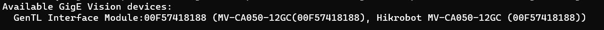

## 2. gc_info serialNumber
列出序列号为serialNumber设备的所有相机参数信息。可以执行命令gc_info serialNumber
\> a.txt，将相机参数信息重定向到a.txt文件里，方便查看。

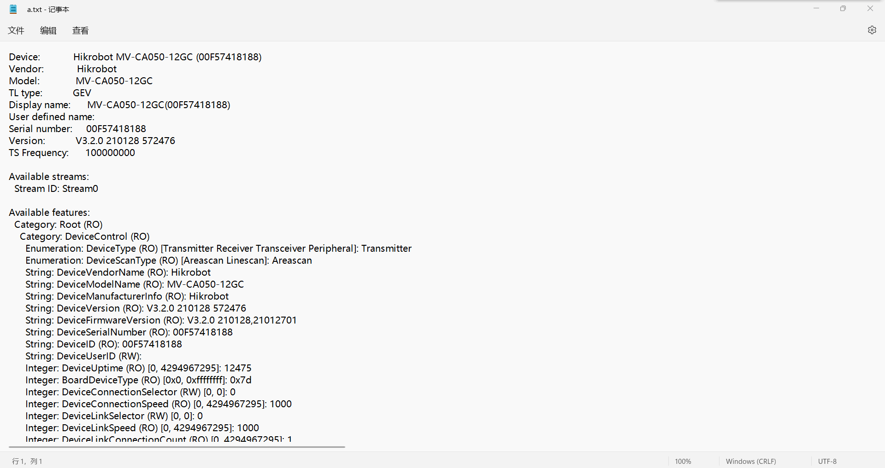

## 3. gc_stream -f png serialNumber n=1

从相机抓取一张图片，-f指定图片格式，可选格式有pnm和png两种，参数n为抓取图片个数。
