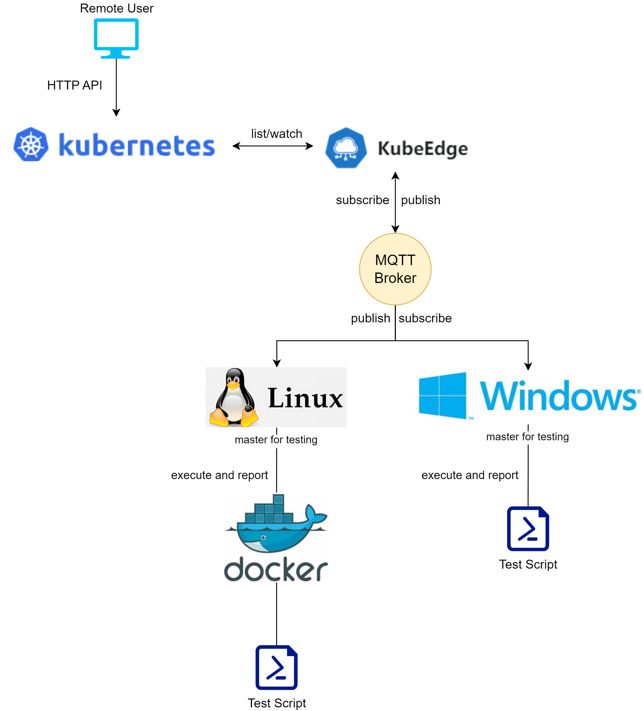

# Windows Execution Virtual Device

## Overall design

Overall, based on the modularity of Kubeedge, this project utilizes the independent data communication capability provided by DeviceTwin module to expand the usage scenarios of Kubeedge and adapt the problems encountered by the actual landing of Kubeedge in the automotive industry:

1. In order to explore the possibility of Kubeedge cloud-native solution in the automotive industry, Kubeedge is introduced for multi-region- and multi-state edge node management, so that automotive software testing can be automated and the testing environment can go to the cloud.

2. With the increase of automotive testing and simulation needs, some traditional industrial software relies on native Windows platform, even though Kubeedge has provided support for Windows Server with container capability, upgrading the original Windows Enterprise Edition machine to Windows Server is unacceptable to the staff and cost department.

3. Automated testing uses third-party simulation and debugging software based on the Windows platform. In order to analyze and model the test data, it is necessary to upload the test process and result data from the test host computer to the cloud.

For this reason, the following design is made:



The overall design is shown in the figure, the software test host, regardless of Windows or Linux, is unified and managed by Kubeedge as a node. Users use K8s API to issue commands to operate it and create corresponding test tasks, and the DeviceTwin module of Kubeedge provides additional data communication capability to realize the triggering and reporting of non-container environment Windows nodes.

## CRDs

Non-containerized Windows environments execute automotive testing tasks that rely on third-party closed-source tools in a bare metal form, where the environment is relatively static and the tasks performed are variable. Therefore, we believe that Windows nodes need a unified executor to execute test tasks (scripts) issued by the cloud, scheduling, running commands and returning data to the cloud.

In this project, automotive software testing has the following characteristics:

1. The execution environment is decentralized and fixed, and the automotive software runs on a collection of hardware called a “pedestal”, which is physically fixed and configured with a PC to access it as a “host computer”. The dais and the host computer are dispersed across the country and around the world, depending on the location of the business unit.
2. Test tasks are dynamically plugged in and out, and their operational status needs to be monitored to prevent the desktop from failing. 3.
3. During the execution of tasks, test logs are constantly generated and need to be aggregated and analyzed in the cloud.

Kubeedge has designed DeviceTwin to support device and data management, and defined CRD resources for Device and DeviceModel. CRD declarative yaml design is simple for users to understand, easy to operate, and can be promoted to testers; Kubeedge CloudCore has implemented DeviceController, a controller for Device resource objects. Kubeedge CloudCore has already implemented DeviceController for Device resource.Considering a test task as a virtual device, according to the design of Kubeedge Device and the requirements of automotive software testing, the Device and DeviceModel are defined as follows:

### Device Model

```yaml
apiVersion: devices.kubeedge.io/v1alpha2
kind: DeviceModel
metadata: 
  name: win-exec-model
  namespace: default
spec:
  properties:
    - name: exec-file-content
      description: custom content to execute
      type:
        string: 
          accessMode: ReadOnly
    - name: exec-file-name
      description: save custom content as filename
      type: 
        string:
          accessMode: ReadOnly
    - name: exec-command
      description: entrypoint of target
      type:
        string:
          accessMode: ReadOnly
    - name: status
      description: status of current executation
      type:
        string:
          accessMode: ReadWrite
    - name: output
      description: console output of current executation
      type:
        string:
          accessMode: ReadWrite
```

### Device Instance

```yaml
apiVersion: devices.kubeedge.io/v1alpha2
kind: Device
metadata:
  name: exec-instance-001
  labels:
    description: "test"
    model: win-exec-model
spec:
  deviceModelRef:
    name: win-exec-model
  nodeSelector:
    nodeSelectorTerms:
      - matchExpressions:
        - key: ''
          operator: In
          values:
            - win11-node
  protocol:
    customizedProtocal:
      protocolName: winExec
status:
  twins:
    - propertyName: status
    - propertyName: output
    - propertyName: exec-file-content
      desired:
        value: 'echo "hello,world"'
    - propertyName: exec-file-name
      desired:
        value: 'run.bat'
    - propertyName: exec-command
      desired:
        value: 'run.bat'
```

The Device Instance is defined based on the Device Model and instantiates the contents of exec-file-content, exec-file-name and exec-command. The status and output fields are reflected in the actual field after the execution is completed, and the result is reported to the cloud as the test task script. The result of the execution is reported to the cloud.

## Mapper

According to the docs/proposals/device-crd.md document, the lifecycle of an IoT device consists of six parts: registration, configuration, upgrade, monitoring, logout, and destruction. Among them, registration, upgrade, logout, and destruction are not considered in the device-crd.md document. Therefore, device is designed for device configuration and monitoring. Configuration is designed to reconfigure the device multiple times without adding new functionality, setting the expected expectation in the CRD, i.e., a declarative configuration of the behavior that the device should have. Monitoring is designed to constantly update the state of the device so that the cloud can be informed of the state of the device in time for the next step.

Considering the test task as an abstract device, configuring the device means setting the parameters of the test task; monitoring the status of the device means collecting and monitoring the execution logs of the test task.

The execution of test tasks and reporting of results uses only a small portion of the mapper framework, which supports device creation, query and deletion, and does not require the introduction of complete framework logic. The operations are triggered as callback functions, controlled by the cloud, and in addition to the cloud commands, messages are actively pushed to the local MQTT to trigger the next operation. mapper loads the local database into memory at startup, and then triggers the execution of the task and the reporting of the status based on the type of message.
